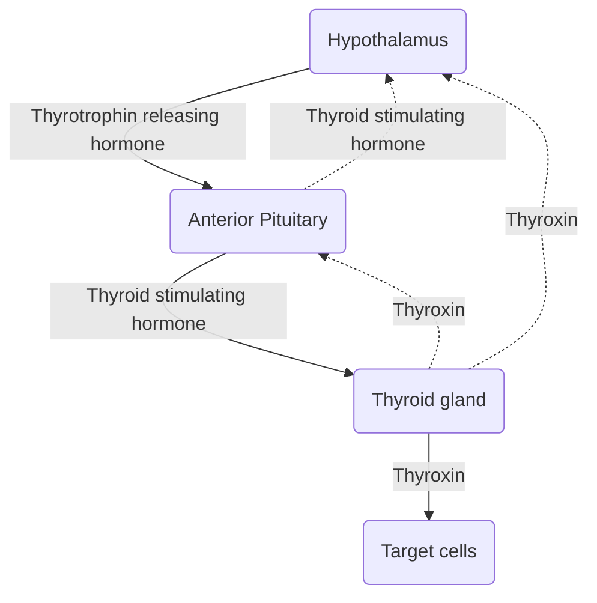
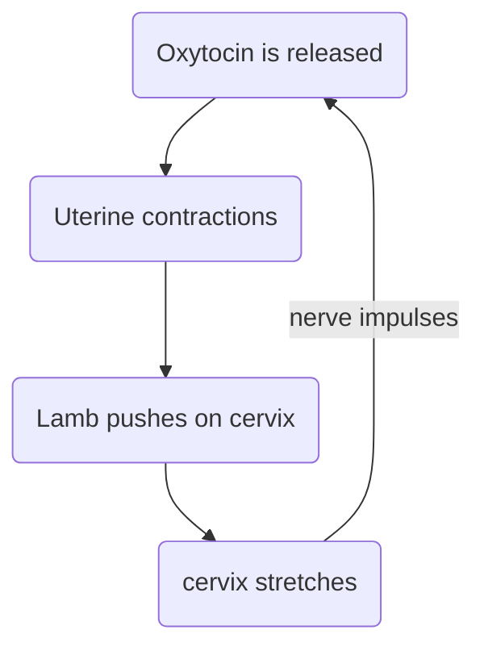

---
tags:
- flashcards/c2s
- course/year_1/semester_1/cells_to_systems
- homeostasis
---

- [x] C2S - L1 ⏫ 📅 2023-03-01 ✅ 2023-03-02

# C2S - L1 - Homeostasis and Body Systems
## Intended Learning Outcomes
* Describe the relationship between cells, tissues, organs and body systems in terms of their anatomical structure and physiological functions 
* Describe the basic structure of a cell and understand the function of the major cell components 
* Explain the general concept of homeostasis and the principles of positive and negative feedback in physiological systems

## Cells
The cell is the basic structural unit of life

What are some of the basic functions of cells
?
obtaining nutrients and oxygen
producing energy from nutrients and oxygen
eliminating wastes
synthesizing proteins
controlling the movement of molecules into the cell
growth

What are cells general or specialized and what is the term::cells are specialized (differentiated) to be able to perform specific functions optimally

What is the cell membrane::A thin membrane that encloses the cell and controls movement of molecules into the intra cellular fluid (ICF) and the extra cellular fluid (ECF)

What is the nucleus::Contain's the DNA inside cells and is the control centre

What is the name given to DNA complexed to protein::Chromatin

Nucleolus is the site of what function::ribosome assembly

What is the endoplasmic reticulum::membranous system of fluid filled tubules and sacs

Compare the smooth ER and rough ER
?
Rough: ribosomes attached, synthesizes proteins for secretion and membrane construction
Smooth: no ribosomes, carbohydrate metabolism and lipid synthesis

What does the Golgi apparatus do::Post translational modification of proteins and packing of proteins and lipids particularly for export.

What is the mitochondria::powerhouse of the cell, generates energy for cellular function, site of oxidation of carbohydrates and lipids

What is the function of ribosomes::Synthesis proteins from mRNA under the direction of nuclear DNA, some are attached to the RER and others are free in the cytosol.

What is the function of lysosomes::Intra-cellular digestive system, sacs containing enzymes that digest cellular macromolecules.

What is the function of peroxisomes::Sacs containing enzymes which detoxify cellular waste

What is the function of the cytoskeleton::intracellular scaffolding to support and organize cellular components. Includes microtubules, microfilaments, and intermediate filaments

## Tissues

What is a tissue::group of cells that carry out a similar function

What are the 4 types of tissue and what is each of their functions
?
Nervous tissue: cells specialized in initiating and transmitting electrical signals
Epithelial tissue: cells specialized in the exchange of materials between the cell and the environment
Connective tissue: cells and extracellular matrix specialized for connecting and supporting
Muscle: cells specialized for contraction

## Organs

What is an organ::Two or more tissues organized together to perform a specific function

Outline the tissues utilized in the stomach
?
Epithelial tissue used to control absorption and secretion
Smooth muscle tissue in the wall to contract the stomach
Nervous tissue in the wall to control the frequency of contraction
Tissue types are bond by connective tissue

## Body Systems

What is a body system::Groups of organs that perform related functions

What organs are included in the digestive system
?
Mouth, salivary glands, pharynx
Oesophagus, stomach, intestines
Pancreas, liver, gall bladder

## Organism

What is an organism::Composed of many body systems packaged together to form an organism. Many complex body processes require the interaction of multiple body systems.

## Homeostasis

What is the definition of homeostasis::The ability of a physiological system to maintain conditions in the body at a relatively constant state of equilibrium

What is a homeotherm::An animal that regulates it's body temperature and often keeps it within a narrow range.

What are the body temperature ranges of cats, horses, sheep, dairy cattle, and dogs
?
Cat: 38.1 - 39.2
Horse: 37 - 38.3
Sheep: 38.5 - 39.9
Dairy cattle: 38.0 - 39.3
Dog: 37.9 - 39.9

Describe the 5 steps in homeostasis
?
1. Stimulus: produces a change in the variable
2. Receptor: detects the change
3. Input: information sent along the afferent pathway to the control center
4. Output: sent along the efferent pathway to effector
5. Response: effector feeds back to reduce the effect of the stimulus
Stimulus received, Receptor engaged, Input via afferent processed, Output dispatched via efferent, Response achieved - S.R.I.O.R. to success!

Describe the 5 steps of homeostasis for thermoregulation
1. Sun provides stimulus
2. Skin receptors sense heat
3. Hypothalamus regulates heat
4. Efferent autonomic pathways
5. Vasodilation and panting to reduce heat

What type of feedback loop is used in homeostasis::Negative feedback is used to down regulate the effect of a stimulus, which contribute to steady state. Failure to negatively regulate can cause or be caused by disease.

What does positive feedback do::amplifies the change which moves the parameter away from the steady state (pregnancy contractions)

Describe the negative feedback used in thyroid hormone production
?
Hypothalamus produces Thyrotrophin releasing hormone
Thyrotrophin releasing hormone stimulates the anterior pituitary
Anterior pituitary produces Thyroid stimulating hormone
Thyroid stimulating hormone down regulates the hypothalamus
Thyroid stimulating hormone stimulates the thyroid 
The thyroid produces thyroxin
Thyroxin down regulates the hypothalamus and anterior pituitary
Thyroxin reaches the target cells

Describe the positive feedback of birth
?
1. Oxytocin is released causing uterine contractions
2. Uterine contractions cause the lamb to push on the cervix
3. The pushing causes the cervix to stretch
4. The cervix stretches causing the brain to release oxytocin

