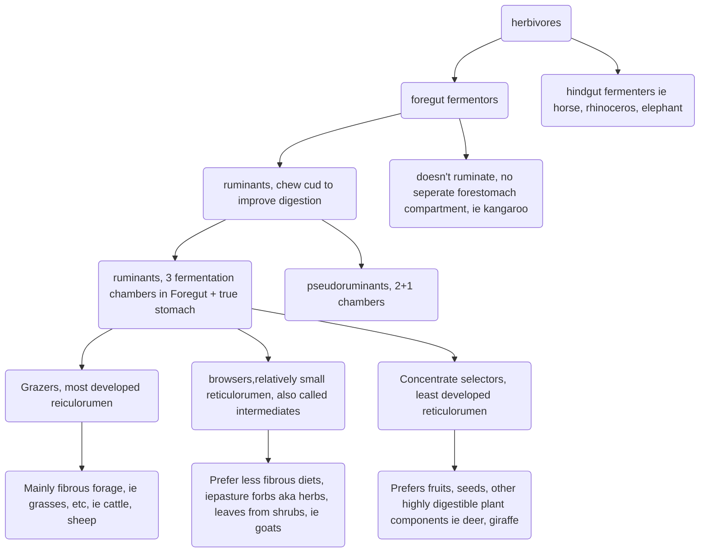

---
tags:
- flashcards/ivp
- course/year_1/semester_1/introduction_to_the_veterinary_profession
- nutrition
---

- [x] IVP - L3 📅 2023-03-14 ✅ 2023-03-15

# IVP - L03 - Introduction To Nutrition
## Intended Learning Outcomes
- Identify the different types of feed, & their source, required by different animal species, in order to compare their importance in diets for different animals.
- Compare & contrast the nutritional requirements & methods of obtaining nutrients from feed of herbivores, carnivores, & omnivores; in order to assess the appropriateness of different diets and feedstuffs for different groups of animals.

What are some uses of animals::food, fibre, work

Why is feeding natural diets difficult
?
Price, convenience, safety (cats and dogs)
Feed for growth (production animals)
Feeding for performance (horses, racing greyhounds)

What are some equine diseases that are linked to diet and feeding practices::tooth problems, colic, obesity, laminitis, equine asthma, hyperlipidaemia, tying up

What are the 3 major functions of foods
?
Energy: provided by carbohydrates, fats, fibre (herbivores especially), proteins
Tissue building blocks: provided by proteins and fats
Essential components: enzymes, hormones, vitamins

What are the sources of food components
?
Carbohydrates: concentrates, forages
Protein: plants (concentrates & forages), meat, milk and eggs
Fats and oils: meats, milk and eggs, plants (concentrates, seeds, fruits)
Micronutrients: all feed types
Fibre: plants (forages), indigestible to carnivores, but major herbivore food source

What is an essential amino acid that must included in the diet of cats::Taurine

What do we want from a pasture::supplies energy, fibre, protein, and can be achieved with sown or natural pastures and plants

What is an ideal pasture
?
Nutritious
Meet nutritional requirements year round
Persists under grazing and out-competes weeds
Maintains ground cover (prevents erosion)
Doesn't cause health problems

What is the difference between forage and concentrations::forage is mostly plants that can be fresh, ensiled, or dry (hay, in paddock) where as concentrate is mostly seeds and fruits

Describe the composition of forage
?
High in fibre:
- Plants' structure derived from 'structural carbohydrates': cellulose, hemicellulose, pectin, lignin
- Indigestible by the mammalian gastrointestinal enzymes
- BUT microbes can digest C, HC and P to obtain energy
- Herbivores use microbial function to digest plan fibre
- Very few organisms can digest lignin
Lower in energy
Variable in protein
Slow release form of energy

What aspects are important to retain in forage
?
Legumes like clover or lucerne fix atmospheric nitrogen and are high protein forages
Grasses use nitrogen from legumes but grow more than legumes and cause fever disease and perennials don't dive over summer and leave bare ground

Describe how forage nutrient can change over the course of the year
?
Autumn: Quality low before rainfall starts to increase
Winter: High quality but low quantity
Spring: High quality, abundant quantity,
Summer: Quality and quantity decline

Describe the energy concentration, fibre, and protein in concentrates
?
Higher in energy: start - can be digested by mammalian GIT tract enzymes
Lower in fibre: higher in peas, beans; lower in grains
Variable in protein: high in peas, beans, and low in grains

What is grain mostly composed of::Starch

What is grass mostly composed of::cellulose and hemicellulose

What is a key aspect of legume composition::high in protein and low in carbohydrates and fibre

What is straw mostly composed of::fibre

## Nutrition From The Animals Point Of View

What are some important adaptions in the head of herbivores for their diet::cheek teeth for grinding, long tongues, dental pad

What are some important adaptions in the head of carnivores::designed for crushing bone and biting chunks of mean, ripping and tearing

What are some unique adaptations of bird heads related to their diet::distended skin below beak in pelican, shovel shaped beak in ducks

What are some unique aspects regarding digestion in birds
?
Birds have no teeth and usually few jaw and tongue muscles (save weight)
Food may be stored in the crop (part of oesophagus)
The glandular part of the stomach is proventriculus
Food grinding is in the muscular gizzard (ventriculus) which may contain swallow grit and stones

T/F Gut complexity increases as diets less based on animal derived feeds:: True, more structures require to release energy stored in plants

What are some aspects of the digestive tract of carnivores::high biological value foods are quickly and easily digested. A simple gut with small storage will do. Diets of animal products are high biological value foods

Compare the omnivore stomach to the carnivore stomach::omnivores have more space for digesting and microbial fermentation

Compare the herbivore stomach and intestine compared to the carnivore
?
Herbivores ferment cellulose and other plant structural CHOs in the fore and/or hindgut
Herbivores need large gut sections to hold enough low density food while its digested and to house microbes to digest plant structural carbohydrates

Where does the majority of digestive processing occur in the following animals: horse, sheep, kangaroo::sheep = fore, horse = hind, kangaroo = fore

Describe foregut fermenters
?
Foregut fermenters get the benefit of microbial digestion FIRST
This is less efficient on high quality feed
Best at utilising low quality feed
Sheep = ruminant foregut fermenters
Kangaroo = non-ruminant foregut fermenters

Describe hindgut fermenters
?
Hindgut fermenters can digest better quality feed themselves in the upper gut
Less wastage than with microbial digestion
But they can't utilise as many microbial products as ruminants without eating their faeces (coprophagy)
Some do this (rabbits, guinea pigs)

Describe the breakdown of herbivores into various classes
?

