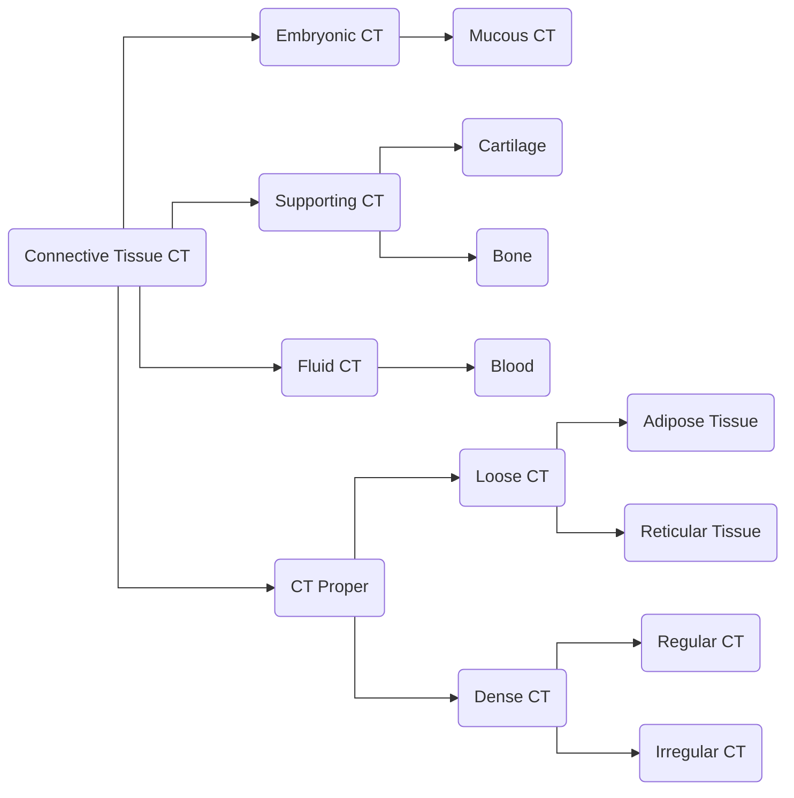

---
tags:
- flashcards/c2s
- course/year_1/semester_1/cells_to_systems
- histology/connective_tissue
---

- [x] C2S - L2 ⏫ 📅 2023-03-01 ✅ 2023-03-02

# C2S - L2 - Connective Tissue
## Intended Learning Outcomes
* Explain how the basic tissue types combine to form body systems 
* Explain the basic structure of connective tissues 
* Identify the cells and extracellular material found in connective tissues

## Histology

Define histology:: The study of tissues at a microscopic level, which can focus on the arrangement of cells within the tissue, structural levels of organization in the body.

What are the two types of microscopes::Light and electron microscope

Why is it important to study histology::To better understand how cells are arranged in the organ to better understand the pathology

How are histological slides prepared
?
1. Fixation usually using 10% formaldehyde for 34 hours
2. Embedding of the tissue where some water is removed and it is placed in a block of paraffin wax
3. Cutting of the tissue into 5 micron slices using a microtome
4. The cells can then be stained using a routine stain giving the cytoplasm a pink colour and the nucleus a blue colour

Summarize the 9 steps for preparing a histological slide
?
1. Remove the organ sample
2. Cut the sample into small pieces
3. Prepare for sectioning by fixating
4. Sectioning using microtome
5. Straightening sections in a water bath
6. Transfer sections to slide
7. Drying on warmer
8. Staining
9. Cover slipping

What is important to remember regarding the slices for histology::It's a 2d representation of a 3d structure

What are some artifacts you can see in histological slides
?
Post-mortem change
Variation in staining
Folds in section
Air bubbles in mounting medium
Shrinking of tissue
Knife marks

What colour do eosinophilic cells pick up and where are they found::pink and in cytoplasm

What colour do basophilic cells pick up and where are they found::blue and in the nucleus. It is based on DNA or RNA which pick up the stain

What does the suffix blast mean for cells::The cells are not yet differentiated

What does the suffix cyte mean for cells::The cells are differentiated

## Connective Tissue

What are the functions of connective tissue
?
Support: supports the epithelial lining
Transportation: lymph is used for transport
Energy Source: adipose tissue for storage
Storage: Can also act as a storage compartment
Inflammation and tissue repair: Important in inflammation and tissue repair

What is connective tissue composed of::cells and extracellular material. There is far more extracellular material and it is composed of amorphous material which lacks shape and fibrous  which has defined fibres.

### Mesenchymal cells

Where are mesenchymal cells found::Often found in embryonic connective tissue

What is the shape of mesenchymal cells::Star shaped with an oval nucleus

### Fibroblast

What type of cell is a fibroblast and what characteristics are associated::Undifferentiated cell that is often very active, proliferate fast, produce a lot of protein and extracellular material. The function of a fibroblast is to create a lot of extracellular material

What is the shape of fibroblast cells::Spindle shaped

How do fibroblast appear under the microscope::They will appear as large blue/purple coloured cells due to the large amount of RNA which is active and will update basophilic stain. The stain in the nucleus due to the active transcript will be light.

What are fibroblasts called why they mature and how do they differ::fibrocytes and they differ as matured cells will be more spindle shaped (longer) with little cytoplasm.

### Adipocytes

What unique structure do adipocytes contain::A fat globule

How can you tell an immature from a mature adipocyte::Mature has a single large fat globule and immature has several small ones

Why do fat cells appear empty under a microscope::Due to the use of ethanol  during the preparation process which removes the fat

### Macrophages

What is a microphage and was is it's function::Large cell involved in the immune response (inflammation). They are phagocytic cells which ingest particulate inside the tissue such as viruses.

How does a microphage engulf and destroy matter::It ingests it into a phagocytic vacuole where lysosomes will break down the matter and then it can either be released or some can remain inside the cell.

How can you tell a macrophage from debris::Look for a nucleus. If there is a nucleus it is a macrophage.

### Mast Cells

What is a unique characteristic of mast cells::They are derived from basophils from the blood and contain many granules. These granules contain material used in immune function.

What are some of the materials contained in mast cells and how do they appear under a microscope::heparin which is an anticoagulant, serotonin, proteins that can digest. These will appear as dark blue under a microscope

### Plasma Cells

What are plasma cells derived from and what is their function::Plasma cells are derived from lymphocytes and are antibody producing cells.

How do plasma cells appear under the microscope and why::Due to activity required to produce antibodies these cells will appear blue with an eccentric nucleus with a clock faced nuclei.

### Melanocytes

What is the function :They are a pigment producing cells often found in the skin but also sometimes the connective tissue

## Extra Cellular Material

What are the 3 types of amorphous extra cellular material and give examples
?
Fluid: blood and lymph
Jelly: common, gives volume to tissue
Solid: connective tissue found in cartilage and bone (osteo)

What are the 3 types of fibrous extra cellular material and give examples
?
Collagen fibres: Most common type found in tissue (1/3 body weight). Made up of type 1 collagen which is found in tissues that are strong and flexible. Often found in tendons and under the skin that holds tissue together. They stain eosinophilic except for the nuclei.
Reticular fibres: Fine fibres that form a network in the tissue which holds cells together. Found in spleen or lymph node as the cells are held together by these fibres. Made up of type 3 collagen fibres. Can use reticulate stain to better identify reticular fibres.
Elastic fibres: Found in tissues which have elasticity such as the skin or blood vessel walls. These fibres help tissues to expand. Verhoeff-van Gieson's stain can be used to identify elastic fibres which appear as black under the microscope. Collagen fibres appear as orange/red under this type of stain.

## Classification of Connective Tissue

How are connective tissues classified
?

What separates regular and irregular connective tissue::Regular is arranged in parallel and irregular is arranged haphazardly

Blank forms the lamina propria of most mucous membranes::Loose connective tissue 

Blank is characteristic of blood-forming organs::Reticular connective tissues

Blank forms the dermis and is able to resist mechanical stress in all directions::Dense irregular connective tissue 

