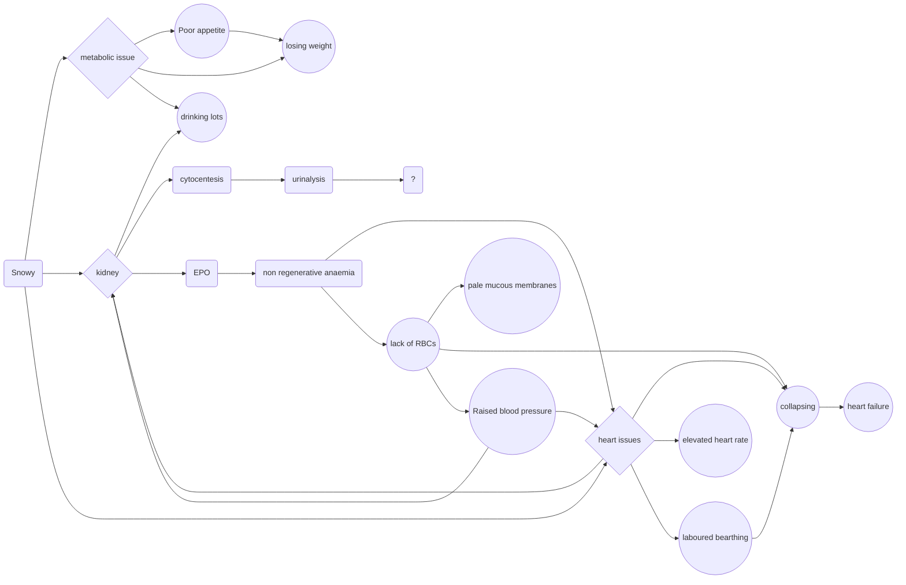

# DS - C1 - Case Study Intro

Main problem for snowy --> chronic kdiney disease

1. Drinking lots, losing weight: kidney filters blood, conserves water, conserves protein
2. Losing weight, not eating: removes urea and waste which results in the build up of blood nitrogen can cause nausea
3. Collapse and weakness: electrolyte balance an regulates red blood cell production
4. Crying, falling off furniture, blindness: Regulates blood pressure

Snowy presented the final time as a blind cat in renal failure

